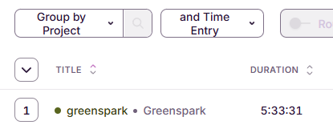

# Greenspark Frontend Task

Resources:
- requirements: https://drive.google.com/file/d/1ISb15W3a_MYC5fTgia0wDFgKmso75RGi
- Figma design: https://www.figma.com/design/RFG3HifUzXdhgs1fgxUdtW/Frontend-task-(Copy)

Hosted result:
- https://greenspark-task-pinia.vercel.app/

To inspect the solution:
- clone the repo
- in root folder: `npm install`
- in `./packages/gs-app-widgets-pinia`
    - either:
        - start the dev server: `npm start`
        - see the locally built result: `npm run build`, then `npm run preview`

## What I did

Implemented the task with my preferred tooling:
- VSCode
- Vite
- TypeScript
- Vue 3 (flavor: Single-File Components, `<script setup>`, Composition API)
- Pinia
- SCSS, Tailwind

Additional tooling in my boilerplate: ESLint, Changesets, Husky + `@commitlint/config-conventional`.

My main considerations were:
- pixel-perfectly matching the Figma design
- clean, robust, type safe code
- minimal dependencies

This core part took roughly 5.5 hours, with frequent interruptions, but I enjoyed getting as close to the Figma design as possible. For tracking I use [Toggl Track](https://toggl.com/):

Where I felt I had notes, I put a comment saying `NOTE(FOR REVIEWERS):`.

Since I saw the task document say:
> FYI, we use Vue.js, Vuex and Typescript

and the soft deadline is said to be "within one week", I chose to put in extra effort to showcase why I might be a good match.

## The Extra Effort

### Vuex implementation

I wanted to show that I can both work with Vuex, and could help migrating to its successor, Pinia, if that is of interest.

Having experience with monorepos, I extracted the UI elements into an internal package, to be shared between the Pinia and Vuex solutions. I deliberately kept the monorepo "vanilla" - no bloated monorepo tooling, just npm.

I created the Vuex solution as another internal package, and left a `NOTE(FOR REVIEWERS):` comment in `packages/gs-app-widgets-vuex/src/components/MainView.vue` describing the difference compared to the Pinia solution.

For good measure, I hosted this as well: https://greenspark-task-vuex.vercel.app/. Though it's rather boring, since the internal UI package works well - there's no visible difference compared to the other solution.
